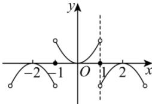

> [!faq]- 全练一本通解析
> **【答案】** BCD
>
> **【解析】**
> 解析：对于 A，因为 $f(x - 1)$ 是奇函数，所以 $f(x)$ 的图象关于 $(-1,0)$ 对称，且 $f(0 - 1) = f(-1) = 0$ ，因为 $f(x)$ 为偶函数，图象关于 $y$ 轴对称，且当 $-1 < x < 1$ 时， $f(x) = x^2$ ，作出 $f(x)$ 的图象，如下图所示：
> 
> 由图可知， $f(x)$ 的值域为 $(-1,1)$ ，故 A 错误；
> 对于 B, $f(x)$ 的图象关于 $(-1,0)$ 对称， $f(x)$ 为偶函数，图象关于 y 轴对称，根据周期相关结论，所以有 $T=4|1-0|=4$ ，所以 $f(x)$ 是以 4 为周期的函数，故 B 正确。
> 对于 C, 由图象可得在 $[-1,1]$ 上， $f(x)$ 的图象与 x 轴有 3 个交点，所以函数在 $[-1,1]$ 上有 3 个零点，故 C 正确； $f(x)$ 对于 D, 由题意得 $f(5)=f(1)=0$ , $f(4)=f(0)=0$ , 所以 $f(5)=f(4)$ , 故 D 正确.
>
> 故选 **BCD**.
