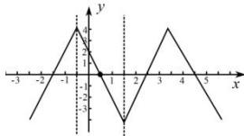

> [!faq]- 全练一本通解析
> **【答案】** C
>
> **【解析】**
> -2
> 解析: 因为 $f\left(x+\frac{1}{2}\right)$ 为奇函数, 所以 $f(x)$ 关于 $\left(\frac{1}{2},0\right)$ 成点对称, $f\left(x-\frac{1}{2}\right)$ 为偶函数,
> 所以 $f(x)$ 关于 $x=-\frac{1}{2}$ 成轴对称, 所以 $T=4\left|\frac{1}{2}+\frac{1}{2}\right|=4$ 因为 $f(0)=2$ ，可作出满足函数性质的简图
> 
> 所以 $f(1)=-f(0)=-2$ , $f(2)=-f(0)=-2$ , $f(3)=-f(1)=2$ , $f(4)=f(0)=2$ ,
> 所以 $\sum_{k=0}^{22}f(k)=2+5\times0-2-2=-2$ .
>
> 故选 **C**.
