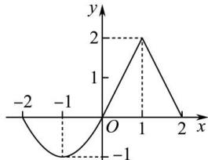

<!-- question-source:start -->
【1】已知函数 $f(x)$ 定义在 $[-2,2]$ 上的图象如图所示, 请分别画出下列函数的图象:

(3) $y = f(-x)$ ;

(4) $y = -f(x)$ ;

(1) $y = f(x + 1)$ ; (2) $y = f(x) + 1$ ;

(5) $y = |f(x)|$ ;

(6) $y = f(|x|)$ .

<!-- question-source:end -->

![[Q00007703A1]]
