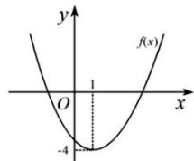

<!-- question-source:start -->
【2】已知函数 $f(x)$ 的图象如图所示, 请分别画出下

列函数的图象:

(1) $y = -f(x) + 1$ ;

(2) $y = f(-x + 3)$ ;

(3) $y = f(|x| - 1)$ ;

(4) $y = \left|f(x + 2)\right|$ .
<!-- question-source:end -->
