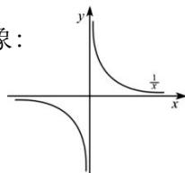

<!-- question-source:start -->
【3】已知函数 $f(x) = \frac{1}{x}$ 的图象如图所示, 通过图像

平移分别画出下列函数的图象:

(1) $f(x) = -\frac{1}{x}$

(2) $f(x) = \frac{1}{|x|}$

(3) $f(x)=\frac{1}{x+1}$

(4) $f(x) = \frac{1}{-x + 2}$

(5) $f(x)=\frac{1-2x}{1-x}$

(6) $f(x) = \frac{2 - x}{x - 1}$
<!-- question-source:end -->
