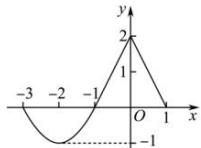
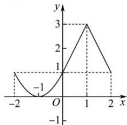
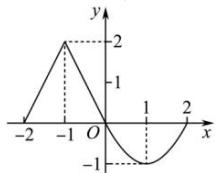
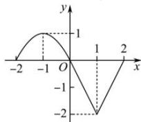
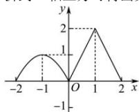
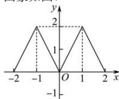

> [!faq]- 全练一本通解析
> **【解析】**
> 答案见解析
> 解析:(1)将函数 $y=f(x)$ 的图象向左平移一个单位可得函数 $y=f(x+1)$ 的图象, 函数 $y=f(x+1)$ 的图象如图:
> 
> (2) 将函数 $y = f(x)$ 的图象向上平移一个单位可得函数 $y = f(x) + 1$ 的图象, 函数 $y = f(x) + 1$ 图象如图:
> 
> （3）函数 $y=f(x)$ 的图象与函数 $y=f(-x)$ 的图象关于 y 轴对称, 函数 $y=f(-x)$ 图象如图:
> 
> （4）函数 $y = f(x)$ 的图象与函数 $y = -f(x)$ 的图象关于 $x$ 轴对称，函数 $y = -f(x)$ 的图象如图：
> 
> （5）将函数 $y = f(x)$ 的图象在 $x$ 轴上方图象保留，下方的图象沿 $x$ 轴翻折到 $x$ 轴上方可得函数 $y = |f(x)|$ 的图象，函数 $y = |f(x)|$ 的图象如图：
> 
> （6）将函数 $y = f(x)$ 的图象在 y 轴左边的图象去掉，在 y 轴右边的图象保留，并将右边图象沿 y 轴翻折到 y 轴左边得函数 $y = f(|x|)$ 的图象，其图象如图：
> 
