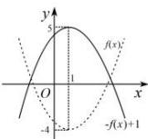
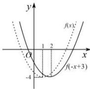
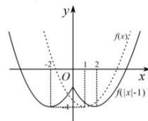
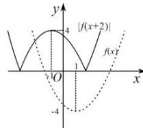

> [!faq]- 全练一本通解析
> **【答案】** 答案见解析
>
> **【解析】**
> （1）将函数 $y = f(x)$ 的图象关于 $x$ 轴对称可得函数 $y = -f(x)$ 的图象，函数 $y = -f(x)$ 的图像向上平移1个单位可得到 $y = -f(x) + 1$ 的图象，如图：
> 
> （2）变换方式1: 将函数 $y = f(x)$ 的图象关于 y 轴对称可得函数 $y = f(-x)$ 的图象, 函数 $y = f(-x)$ 的图像向右平移 3 个单位可得到 $y = f\left(-\left(x-3\right)\right)$ 的图象, 即 $y = f(-x+3)$ ,
> 变换方式2: 将函数 $y = f(x)$ 的图象向左平移3个单位可得到$y=f(x+3)$ 的图象, 函数 $y=f(x+3)$ 的图象关于 y 轴对称可得函数 $y=f(-x+3)$ 的图像, 如图:
> 
> （3）将函数 $y = f(x)$ 的图象向右平移1个单位可得到 $y = f(x - 1)$ 的图象，函数 $y = f(x - 1)$ 的图象在 $y$ 轴左边的图象去掉，在 $y$ 轴右边的图象保留，并将右边图象沿 $y$ 轴翻折到 $y$ 轴左边得函数 $y = f(|x| - 1)$ 的图象，其图象如图：
> 
> （4）将函数 $y = f(x)$ 的图象向左平移2个单位可得到 $y = f(x + 2)$ 的图象，函数 $y = f(x + 2)$ 的图象在 $x$ 轴上方图象保留，下方的图象沿 $x$ 轴翻折到 $x$ 轴上方可得函数 $y = |f(x + 2)|$ 的图象，函数 $y = |f(x)|$ 的图象如图：
> 
> ##
