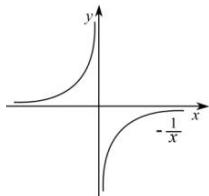
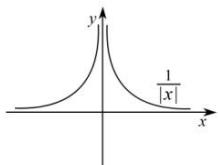
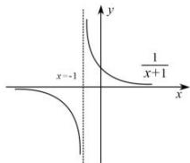
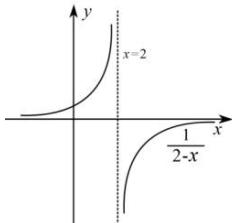
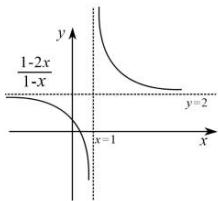
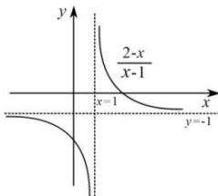

> [!faq]- 全练一本通解析
> **【解析】**
> 答案见解析
> 解析：（1）将函数 $f(x)=\frac{1}{x}$ 的图象关于 y 轴对称可得函数 $f(x)=-\frac{1}{x}$ 的图象，如图：
> 
> (2) 函数 $f(x) = \frac{1}{x}$ 的图象在 $y$ 轴左边的图象去掉, 在 $y$ 轴右边的图象保留, 并将右边图象沿 $y$ 轴翻折到 $y$ 轴左边得函数 $f(x) = \frac{1}{|x|}$ 的图象, 其图象如图:
> 
> (3) 函数 $f(x)=\frac{1}{x}$ 的图像向左平移 1 个单位可得到 $f(x)=\frac{1}{x+1}$ 的图象，如图：
> 
> （4）变换方式1:将函数 $f(x)=\frac{1}{x}$ 的图象向左平移2个单位可得到 $f(x)=\frac{1}{x+2}$ 的图像,再将 $f(x)=\frac{1}{x+2}$ 的图像关于y轴对称可得函数 $f(x)=\frac{1}{-x+2}$ 的图象.
> 变换方式2: 将函数 $f(x)=\frac{1}{x}$ 的图象关于 y 轴对称可得函数 $f(x)=\frac{1}{-x}$ 的图象.，函数 $f(x)=\frac{1}{-x}$ 的图象向右平移2个单位可得到 $f(x)=\frac{1}{-x+2}$ 的图像, 如图:
> 
> （5）先分离常数 $f(x) = \frac{1 - 2x}{1 - x} = \frac{2(1 - x) - 1}{1 - x} = 2 - \frac{1}{1 - x}$ 将函数 $f(x) = \frac{1}{x}$ 的图象关于 $y$ 轴对称可得函数 $f(x) = \frac{1}{-x}$ 的图象.，函数 $f(x) = \frac{1}{-x}$ 的图象向右平移1个单位可得到 $f(x) = \frac{1}{-(x - 1)} = \frac{1}{-x + 1}$ 的图像，再将 $f(x) = \frac{1}{-x + 1}$ 的图像关于 $x$ 轴对称可得函数 $f(x) = -\frac{1}{-x + 1}$ 的图象.再将图像向上平移2个单位长度.如图：
> 
> （6）先分离常数 $f(x) = \frac{2 - x}{x - 1} = \frac{-(x - 1) + 1}{x - 1} = -1 + \frac{1}{x - 1}$ 将函数 $f(x) = \frac{1}{x}$ 的图象向右平移1个单位长度，可得函数 $f(x) = \frac{1}{x - 1}$ 的图象.，函数 $f(x) = \frac{1}{x - 1}$ 的图象向下平移1个单位可得到 $f(x) = -1 + \frac{1}{x - 1}$ 的图像，如图：
> 
