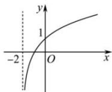
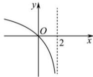

<!-- question-source:start -->
【5】(2022·重庆高三统考阶段练习)已知函数 $f(x)$ 的图象如图 1 所示, 则图 2 所表示的函数是（）

图1

图2

A. $1 - f(x)$ B. $-f(2 - x)$ C. $f(-x) - 1$ D. $1 - f(-x)$
<!-- question-source:end -->

![[Q00007707A1]]
