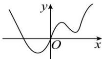
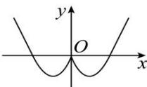

<!-- question-source:start -->
【9】（2023·河南模拟预测）已知图1对应的函数为 $y = f(x)$ ，则图2对应的函数是（）

图1
图2

A. $y = f(-|x|)$ B. $y = f(-x)$ C. $y = f(|x|)$ D. $y = -f(-x)$
<!-- question-source:end -->

![[Q00007711A1]]
