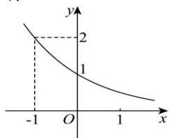

<!-- question-source:start -->
【10】（21-22 高一上·黑龙江鸡西·期末）（多选）定义在 R 上的函数 $y = f(x + 1) + 1$ 的图像如图所示，它在定义域上是减函数，给出下列结论，其中正确的有（）

A. $f(-1) = 1$ B. $f(0) = 1$ C.若 $x <   0$ ，则 $f(x) > 0$ D.若 $x > 0$ ，则 $f(x) <   0$
<!-- question-source:end -->
