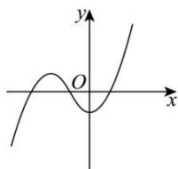
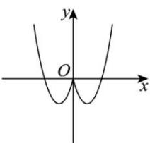
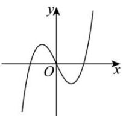
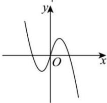

<!-- question-source:start -->
【13】（24-25 高一·浙江宁波）已知函数 $f(x+1)$ 的图象关于点 $(-1,0)$ 对称，且 $\forall x_{1}, x_{2} \in (1,+\infty), x_{1} \neq x_{2}, (x_{1}-x_{2})[f(x_{1})-f(x_{2})]>0$ ，则 $f(x)$ 的图象可能是（）

A.

B.

C.  

D.  

<!-- question-source:end -->
