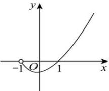
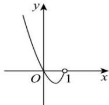

<!-- question-source:start -->
【14】(24-25 高三·四川成都·练习) 若函数 $y = f(x)$ 的图象如图 1 所示, 则如图 2 对应的函数可能是()

图1
图2

A. $y = f(1 - 2x)$ B. $y = f\left(1 - \frac{1}{2} x\right)$ C. $y = -f(1 - 2x)$ D. $y = -f\left(1 - \frac{1}{2} x\right)$
<!-- question-source:end -->

![[Q00007716A1]]
