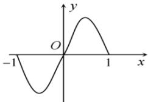
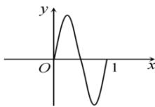

<!-- question-source:start -->
【15】（2022·江西赣州·二模）已知函数 $f(x)$ 的图象的一部分如下左图，则如下右图的函数图象所对应的函数解析式（）

A. $y = f(2x - 1)$ B. $y = f\left(\frac{4x - 1}{2}\right)$ C. $y = f(1 - 2x)$ D. $y = f\left(\frac{1 - 4x}{2}\right)$
<!-- question-source:end -->

![[Q00007717A1]]
