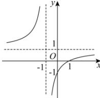

> [!faq]- 全练一本通解析
> **【答案】** B
>
> **【解析】**
> 解析: $f(x)=\frac{x-1}{x+1}=\frac{x+1-2}{x+1}=1-\frac{2}{x+1}$ ,
> 函数 $f(x)$ 的图象是由函数 $y=-\frac{2}{x}$ 的图象向左平移1个单位,
> 再上上平移1个单位得到的,
> 所以 $f(x)$ 的图象关于点 $(-1,1)$ 对称, 且在 $[0,+\infty)$ 上是增函数.
> 
>
> 故选 **B**.
