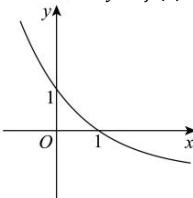

> [!faq]- 全练一本通解析
> **【答案】** BC
>
> **【解析】**
> 解析: 将 $y = f(x + 1) + 1$ 图像向右平移 1 个单位长度，再向下平移 1 个单位长度得到 $y = f(x)$ 图像，如图所示：
> 
> 由图像可知，A 错误，B 正确，
> 又当 x<1 时， $f(x)>0$ ，当 x>1 时， $f(x)<0$ ，故 C 正确，D 错误.
>
> 故选 **BC**.
