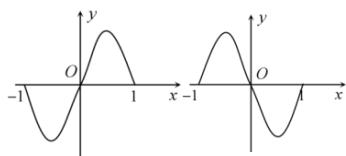
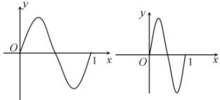

> [!faq]- 全练一本通解析
> **【答案】** C
>
> **【解析】**
> 解析：
> 
> 
> $$
> y = f (x) \stackrel {① x \rightarrow - x} {\rightarrow} y = f (- x) \stackrel {② x \rightarrow x - 1} {\rightarrow} y = f (1 - x) \stackrel {③ x \rightarrow 2 x} {\rightarrow} y = f (1 - 2 x)
> $$
> - **①**：关于 y 轴对称②向右平移 1 个单位③纵坐标不变, 横坐标变为原来的一半
>
> 故选 **C**.
