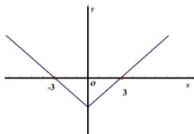

> [!faq]- 全练一本通解析
> **【答案】** D
>
> **【解析】**
> 解析：
> 因为 $f(x - 3)$ 的图象关于 $x = 3$ 对称， $f(-3) = 0$
> 所以 $f(x)$ 的图象关于 y 轴对称， $f(3)=0$
> 又因为 $f(x)$ 在 $[0,+\infty)$ 上单调递增，
> 所以函数 $f(x)$ 的草图如下：
> 
> 所以 $f(x - 1)\geq 0\Rightarrow x - 1\geq 3$ 或 $x - 1\leq -3$ ，解得： $x\geq 4$ 或 $x\leq -2$ .
>
> 故选 **D**
