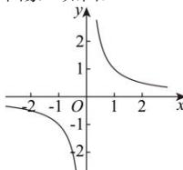
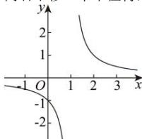
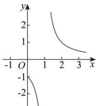
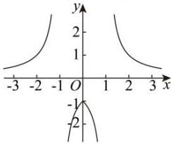

> [!faq]- 全练一本通解析
> **【答案】** 作图见解析
>
> **【解析】**
> 先作函数 $y = \frac{1}{x}$ 的图象，再作 $y = \frac{1}{x - 1}$ 的图象，再作 $y = \frac{1}{|x| - 1}$ 的图象．如图：
> 
> 向右平移一个单位得，
> 
> 根据定义域 $[0, +\infty)$ 作图得，
> 
> 在根据图象关于 y 轴对称补全图象得，
> 
