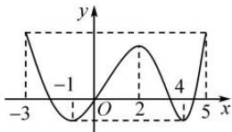

<!-- question-source:start -->
【19】（2023·全国高一专题练习）已知 $y = f(x)$ 的图象如图所示，则该函数的单调增区间为（）

A. $[-1,3]$ B. $[-1,2]$ 和 $[4,5]$ C. $[-1,2]$ D. $[-3,-1]$ 和 $[2,4]$
<!-- question-source:end -->

![[Q00007627A1]]
