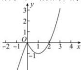

> [!faq]- 全练一本通解析
> **【解析】**
> 增区间为 $(-\infty,0)$ 和 $(1,+\infty)$ ，减区间为 $(0,1)$ .
> 解析: 因为 $f(x)=|x|(x-2)=\left\{\begin{aligned}x^{2}-2x,x&\geq0\\ -x^{2}+2x,x&<0\end{aligned}\right.$ 所以该函数的图象如下图所示：
> 
> 由函数图象可知, 该函数的增区间为 $(-∞,0)$ 和 $(1,+∞)$ , 减区间为 $(0,1)$ .
