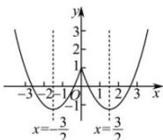

> [!faq]- 全练一本通解析
> **【解析】**
> $\left(-\infty,-\frac{3}{2}\right)$ 和 $\left(\frac{3}{2},+\infty\right)$ 解析： $y=x^{2}-3|x|+1=\left\{\begin{aligned}x^{2}-3x+1,x&\geq0\\ x^{2}+3x+1,x&<0\end{aligned}\right.$ 由此画出函数 $y=x^{2}-3|x|+1$ 的图象如下图所示，
> 由图可知，函数 $y=x^{2}-3|x|+1$ 的单调递减区间为 $\left(-∞,-\frac{3}{2}\right)$ 和 $\left(\frac{3}{2},+\infty\right)$
> 
