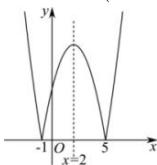

> [!faq]- 全练一本通解析
> **【解析】**
> $(-∞,-1),(2,5)$ 解析:由 $-x^{2}+4x+5=0$ ，得到 x=-1 或 x=5，
> 函数 $y=\left|-x^{2}+4x+5\right|$ 的图像如图所示，
> 由图知，函数 $y=\left|-x^{2}+4x+5\right|$ 的单调递减区间为 $(-∞,-1),(2,5)$ ，
> 故答案为： $(-∞,-1),(2,5)$ .
> 
