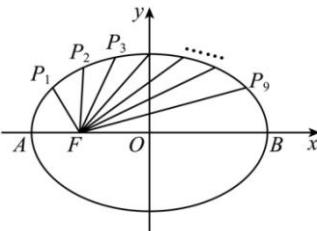

<!-- question-source:start -->
【9】（2023·江西景德镇高二上期中）如图，把椭圆 $\frac{x^{2}}{4}+\frac{y^{2}}{3}=1$ 的长轴AB分成10等份，过每个分点作x轴的垂线分别交椭圆的上半部分于点 $P_{1},P_{2},\ldots,P_{9}$ ，F是左焦点，则 $\left|P_{1}F\right|+\left|P_{2}F\right|+\cdots+\left|P_{9}F\right|$ （）

A. 16 B. 18 C. 20 D. 22
<!-- question-source:end -->
