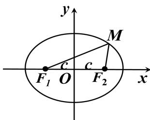

## 2. 椭圆标准方程的推导：

(1) 怎样建立适当的直角坐标系?

以经过点 $F_{1}$ 、 $F_{2}$ 的直线为 $x$ 轴，线段 $F_{1}F_{2}$ 的垂直平分为 $y$ 轴建立直角坐标系 $xOy$ ，如图1.

(2) 椭圆可以看作是哪些点的集合? 用坐标如何表示?

设点 $M(x,y)$ 是椭圆上任一点, 椭圆的焦距为 2c (c>0).

焦点 $F_{1},F_{2}$ 的坐标分别是 $(-c,0),(c,0)$ ,

又设 M 与 $F_{1}, F_{2}$ 的距离的和等于常数 2a.

由椭圆的定义, 椭圆就是集合 $P = \left\{M \left| \left| MF_{1} \right| + \left| MF_{2} \right| = 2a \right. \right\}$

因为 $|MF_{1}| = \sqrt{(x + c)^{2} + y^{2}}$ , $|MF_{2}| = \sqrt{(x - c)^{2} + y^{2}}$

所以 $\sqrt{(x + c)^2 + y^2} +\sqrt{(x - c)^2 + y^2} = 2a$

图1

即 $\sqrt{(x + c)^2 + y^2} = 2a - \sqrt{(x - c)^2 + y^2}$

两边平方得 $(x + c)^2 + y^2 = 4a^2 - 4a\sqrt{(x - c)^2 + y^2} + (x - c)^2 + y^2$

整理得 $a\sqrt{(x - c)^2 + y^2} = a^2 - cx$ ，再平方并整理得 $(a^2 - c^2)x^2 + a^2y^2 = a^2(a^2 - c^2)$

两边同除以 $a^2 (a^2 -c^2)$ 得 $\frac{x^2}{a^2} +\frac{y^2}{a^2 - c^2} = 1$

考虑 a > c > 0，应有 $a^{2} - c^{2} > 0$ ，故设 $b^{2} = a^{2} - c^{2}$ ，就有 $\frac{x^{2}}{a^{2}} + \frac{y^{2}}{b^{2}} = 1$
