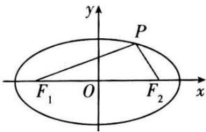
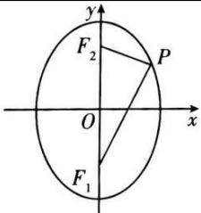

## 3. 椭圆的标准方程对比

<table><tr><td>定义</td><td colspan="2"> $|PF_1| + |PF_2| = 2a(2a > |F_1F_2| > 0)$ </td></tr><tr><td>图形</td><td></td><td></td></tr><tr><td>标准方程</td><td> $\frac{x^2}{a^2} + \frac{y^2}{b^2} = 1 (a > b > 0)$ (焦点在x轴)</td><td> $\frac{y^2}{a^2} + \frac{x^2}{b^2} = 1 (a > b > 0)$ (焦点在y轴)</td></tr><tr><td>焦点</td><td> $F_1(-c,0), F_2(c,0)$ </td><td> $F_1(0,-c), F_2(0,c)$ </td></tr><tr><td>a,b,c的关系</td><td colspan="2"> $a^2 = b^2 + c^2$ </td></tr></table>
