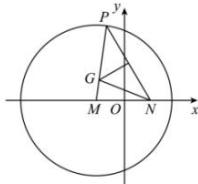

> [!faq]- 全练一本通解析
> **【答案】** $\frac{x^{2}}{4}+\frac{y^{2}}{2}=1$
>
> **【解析】**
> 由题意知,线段 PN 的垂直平分线交 PM 于 G 点,所以 $\left|GN\right|=\left|GP\right|$ ,
> ∴ $\left|GM\right| + \left|GN\right| = \left|GM\right| + \left|GP\right| = \left|MP\right| = 4 > 2\sqrt{2} = \left|MN\right|$ ,
> ∴点 G 在以 M、N 为焦点，长轴长为 4 的椭圆上， $2a=4,\quad2c=2\sqrt{2},\quad b^{2}=a^{2}-c^{2}=2$ ∴点 G 的轨迹 C 的方程为 $\frac{x^{2}}{4}+\frac{y^{2}}{2}=1$ 故答案为： $\frac{x^{2}}{4}+\frac{y^{2}}{2}=1$
> 
