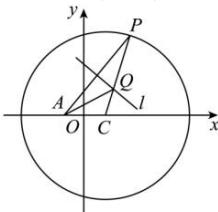

> [!faq]- 全练一本通解析
> **【答案】** $\frac{x^2}{4} +\frac{y^2}{3} = 1$
>
> **【解析】**
> 圆 $C:(x-1)^{2}+y^{2}=16$ 的圆心 $C(1,0)$ ，半径 r=4，点 Q 在线段 PA 的中垂线 l 上，如图，
> 
> 有 $|QP| = |QA|$ ，则 $|QA| + |QC| = |QP| + |QC| = r = 4 > |AC|$ ，因此点 $Q$ 的轨迹是以 $A, C$ 为焦点，实轴长 $2a = 4$ 的椭圆，则虚半轴长 $b = \sqrt{2^2 - 1^2} = \sqrt{3}$ ，所以点 $Q$ 的轨迹方程为 $\frac{x^2}{4} + \frac{y^2}{3} = 1$ 。故答案为： $\frac{x^2}{4} + \frac{y^2}{3} = 1$
