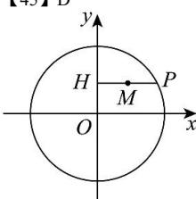

> [!faq]- 全练一本通解析
> **【答案】** D
>
> **【解析】**
> 
> 解析:如下图所示:
> 不妨设 $M(x,y)$ , $P(x_{0},y_{0})$ ，则满足 $x_{0}^{2} + y_{0}^{2} = 4$ ; 易知 $H(0,y_{0})$
> 又线段 $PH$ 的中点为 $M$ ，可得 $x = \frac{x_0}{2}, y = y_0$ ；
> 即 $x_0 = 2x, y_0 = y$ ，代入方程 $x_0^2 + y_0^2 = 4$ 可得 $4x^2 + y^2 = 4$ ，
> 整理得 $x^{2} + \frac{y^{2}}{4} = 1$ .
>
> 故选 **D**
