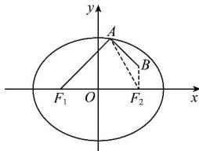

> [!faq]- 全练一本通解析
> **【答案】** A
>
> **【解析】**
> 解析:设椭圆的半焦距为 c，则 $F_{2}(2,0)$ ，a=3
> 
> 如图，连接 $AF_{2}$ ，则 $\left|AB\right| + \left|AF_1\right| = \left|AB\right| + 2a - \left|AF_2\right| = 6 + \left|AB\right| - \left|AF_2\right|$ 而 $\left|AB\right| - \left|AF_2\right|\leq \left|BF_2\right| = 1$ 当且仅当 $A,F_{2},B$ 共线且 $F_{2}$ 在 $A,B$ 中间时等号成立，故 $\left|AB\right| + \left|AF_1\right|$ 的最大值为7.
>
> 故选 **A**.
