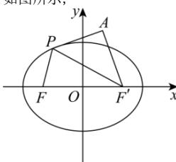

> [!faq]- 全练一本通解析
> **【答案】** C
>
> **【解析】**
> 解析:由椭圆方程可知: $a=3, b=\sqrt{5}, c=\sqrt{a^{2}-b^{2}}=2$ ,
> 设右焦点为 $F'$ ，则 $F(-2,0)$ ， $F'(2,0)$ ，且 $\left|PF\right| + \left|PF'\right| = 6$ ，即 $\left|PF\right| = 6 - \left|PF'\right|$
> 如图所示，
> 
> 可得： $\left|PF\right|-\left|PA\right|=6-\left(\left|PF'\right|+\left|PA\right|\right)\leq6-\left|AF'\right|=3$
> 当且仅当 P 在线段 $AF'$ 上时, 等号成立,
> 所以 $\left|PF\right|-\left|PA\right|$ 的最大值为 3.
>
> 故选 **C**.
