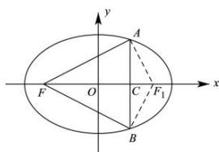

> [!faq]- 全练一本通解析
> **【解析】**
> 12
> 解析:如图. 设 AB 与 x 轴相交于点 C, 椭圆 $\frac{x^{2}}{9} + \frac{y^{2}}{4} = 1$ 右焦点为 $F_{1}$ ，连接 $AF_{1}, BF_{1}$
> 
> 所以 $\triangle ABF$ 周长为
> $$
> A F + B F + A B = 6 - A F _ {1} + 6 - B F _ {1} + A B = 1 2 - \left(A F _ {1} + B F _ {1} - A B\right) \leq 1 2
> $$
> 故 $\triangle ABF$ 的周长的最大值为 12, 故答案为: 12.
