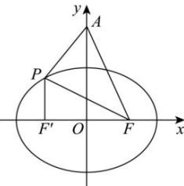

> [!faq]- 全练一本通解析
> **【答案】** D
>
> **【解析】**
> 
> 解析：
> 由椭圆方程 $\frac{x^{2}}{9}+\frac{y^{2}}{5}=1$ 得 a=3
> $$
> b = \sqrt {5}, c = \sqrt {a ^ {2} - b ^ {2}} = 2
> $$
> 设椭圆的左焦点为 $F'$
> 则 $\triangle APF$ 的周长为
> $$
> \left| A F \right| + \left| A P \right| + \left| P F \right| = \left| A F \right| + \left| A P \right| + 2 a - \left| P F ^ {\prime} \right| = 4 + 6 + \left| A P \right| - \left| P F ^ {\prime} \right| \leq 1 0 + \left| A F ^ {\prime} \right|,
> $$
> 当且仅当 $A, P, F'$ 三点共线，且 $P$ 在 $AF'$ 的延长线上时取等号.
> $$
> \because A (0, 2 \sqrt {3}), F ^ {\prime} (- 2, 0)
> $$
> $$
> \therefore \left| A F ^ {\prime} \right| = 4
> $$
> $\therefore \triangle APF$ 的周长最大值为14.
>
> 故选 **D**
