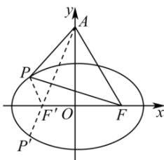

> [!faq]- 全练一本通解析
> **【答案】** $y=\sqrt{3}x+2\sqrt{3}$
>
> **【解析】**
> 椭圆方程: $\frac{x^{2}}{9} + \frac{y^{2}}{5} = 1$ , a = 3, $b = \sqrt{5}$ , c = 2, 如图所示设椭圆的左焦点为 $F'(-2,0)$ ,
> $$
> \left| A F \right| = \sqrt {2 ^ {2} + (2 \sqrt {3}) ^ {2}} = 4 = \left| A F ^ {\prime} \right|
> $$
> 则 $\left|PF\right|+\left|PF'\right|=2a=6$ ，∵ $\left|PA\right|-\left|PF'\right|\leq\left|AF'\right|$ ，如图，当 A， $F'$ ，P 共线时取等号，
> ∴ $\triangle APF$ 的周长 = $\left|AF\right| + \left|PA\right| + \left|PF\right| = \left|AF\right| + \left|PA\right| + 6 - \left|PF'\right| \leq 4 + 6 + 4 = 14$ ，当且仅当三点 A， $F'$ ，P 共线时取等号.
> 则直线 $AP$ 的方程： $\frac{y}{2\sqrt{3}} -\frac{x}{2} = 1$ ，整理得 $y = \sqrt{3} x + 2\sqrt{3}$
> 
> 故答案为： $y=\sqrt{3}x+2\sqrt{3}$
