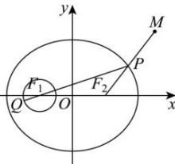

> [!faq]- 全练一本通解析
> **【答案】** B
>
> **【解析】**
> 解析:如图,由题意,椭圆的焦点为 $F_{1}(-2,0)$ , $F_{2}(2,0)$
> 则圆 $(x+2)^{2}+y^{2}=1$ 的圆心是椭圆的左焦点,由椭圆定义得
> $\left|PF_{1}\right| = 2a - \left|PF_{2}\right| = 8 - \left|PF_{2}\right|$ ，所以 $\left|PQ\right|\leq \left|PF_1\right| + 1 = 8 - \left|PF_2\right| + 1 = 9 - \left|PF_2\right|$
> 又 $\left|MF_2\right| = \sqrt{\left(5 - 2\right)^2 + \left(4 - 0\right)^2} = 5$
> $$
> \left| P Q \right| - \left| P M \right| \leq 9 - \left(\left| P F _ {2} \right| + \left| P M \right|\right) \leq 9 - \left| M F _ {2} \right| = 4
> $$
> 故选:B.
> 
