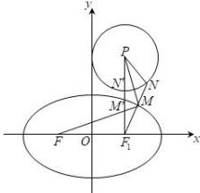

> [!faq]- 全练一本通解析
> **【答案】** A
>
> **【解析】**
> 解析:由 $\odot P:x^{2}+(y-3)^{2}=2x$ ，可得 $(x-1)^{2}+(y-3)^{2}=1$
> 可得圆 $\odot P$ 的圆心坐标为 $P(1,3)$ ，半径 $r = 1$
> 由椭圆 $C:\frac{x^{2}}{4}+\frac{y^{2}}{3}=1$ ，可得 a=2，
> 设椭圆的右焦点为 $F_{1}$ ，根据椭圆的定义可得 $\left|MF\right| = 2a - \left|MF_1\right|$ 所以 $\left|MF\right| - \left|MN\right| = 2a - \left(\left|MF_1\right| + \left|MN\right|\right)$ ，又由 $\left|MN\right|_{\min} = \left|MP\right| - r$ 如图所示，当点 $P,M,N,F_{1}$ 四点共线时，即 $P,N',M',F_{1}$ 时， $\left|MF_1\right| + \left|MN\right|$ 取得最小值，
> 
> 最小值为 $(\left|MF_1\right| + \left|MN\right|)_{\min} = (\left|MF_1\right| + \left|MP\right| - r) = \left|PF_1\right| - r = 3 - 1 = 2$
> 所以 $(\left|MF\right| - \left|MN\right|)_{\max} = 2\times 2 - 2 = 2$ .
>
> 故选 **A**.
