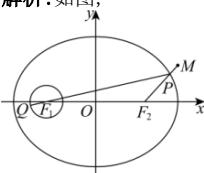

> [!faq]- 全练一本通解析
> **【解析】**
> 8
> 解析:如图,
> 
> 由 $\frac{x^2}{25} +\frac{y^2}{16} = 1$ ，得 $a^2 = 25,b^2 = 16$ ，则 $c = \sqrt{a^2 - b^2} = 3$
> 则圆 $(x+3)^{2}+y^{2}=1$ 的圆心是椭圆的左焦点 $F_{1}(-3,0)$ ，椭圆的右焦点为 $F_{2}(3,0)$ ，
> 由椭圆的定义得 $\left|PF_{1}\right|+\left|PF_{2}\right|=2a=10$
> 所以 $\left|PQ\right|\leq\left|PF_{1}\right|+1=10-\left|PF_{2}\right|+1=11-\left|PF_{2}\right|$
> 又 $\left|MF_2\right| = \sqrt{(5 - 3)^2 + (\sqrt{5} - 0)^2} = 3$
> 所以
> $\left|PQ\right| - \left|PM\right|\leq 11 - \left|PF_{2}\right| - \left|PM\right| = 11 - \left(\left|PF_{2}\right| + \left|PM\right|\right)\leq 11 - \left|MF_{2}\right| = 11 - 3 = 8.$
