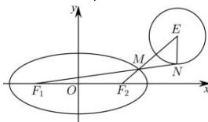

> [!faq]- 全练一本通解析
> **【解析】**
> $2\sqrt{2} -5$
> 解析:由 M 为椭圆 C 上任意一点, 则 $\left|MF_{1}\right| + \left|MF_{2}\right| = 4$
> 又 N 为圆 $E:(x-3)^{2}+(y-2)^{2}=1$ 上任意一点，则 $\left|MN\right|\geq\left|ME\right|-1$ （当且仅当 M、N、E 共线时取等号），
> $$
> \left| M N \right| - \left| M F _ {1} \right| = \left| M N \right| - \left(4 - \left| M F _ {2} \right|\right) = \left| M N \right| + \left| M F _ {2} \right| - 4 \geq \left| M E \right| + \left| M F _ {2} \right| - 5 \geq \left| E F _ {2} \right| - 5
> $$
> 当且仅当 M、N、E、 $F_{2}$ 共线时等号成立.
> ∵ $F_{2}(1,0)$ ， $E(3,2)$ ，则 $\left|EF_{2}\right|=\sqrt{(3-1)^{2}+(2-0)^{2}}=2\sqrt{2}$
> ∴ $\left|MN\right|-\left|MF_{1}\right|$ 的最小值为 $2\sqrt{2}-5$ .
> 故答案为: $2\sqrt{2}-5$ .
> 
