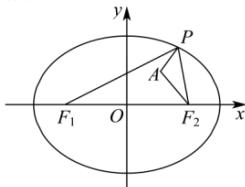

> [!faq]- 全练一本通解析
> **【答案】** $\left[6 - \sqrt{2},6 + \sqrt{2}\right]$
>
> **【解析】**
> 由椭圆的定义可知动点 P 的轨迹为椭圆, 且 2a=6, c=2
> 
> 所以 $\left|PA\right|+\left|PF_{1}\right|=\left|PA\right|-\left|PF_{2}\right|+6$
> 又由三角形的性质可知 $\left\| PA\right| - \left|PF_2\right|\leq \left|AF_2\right| = \sqrt{(2 - 1)^2 + (0 - 1)^2} = \sqrt{2}$ ，当且仅当 $P,A,F_{2}$ 共线时等号成立，
> 所以 $-\sqrt{2} \leq |PA| - |PF_2| \leq \sqrt{2}$ 所以 $6 - \sqrt{2} \leq |PA| + |PF_1| \leq 6 + \sqrt{2}$ 故答案为： $\left[6 - \sqrt{2}, 6 + \sqrt{2}\right]$
