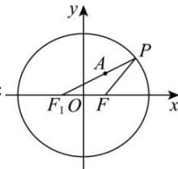

> [!faq]- 全练一本通解析
> **【答案】** A
>
> **【解析】**
> 
> 解析：
> 由 $F(1,0)$ 为椭圆 $\frac{x^{2}}{9}+\frac{y^{2}}{m}=1$ 的焦点，
> $$
> \therefore c = 1, a ^ {2} = 9, b ^ {2} = m
> $$
> $$
> \therefore 9 = m + 1, \therefore m = 8
> $$
> $$
> F _ {1}
> $$
> $$
> \left| P F \right| = 2 a - \left| P F _ {1} \right| = 6 - \left| P F _ {1} \right|
> $$
> $$
> \therefore | P F | + | P A | = 6 + | P A | - | P F _ {1} | \geq 6 - | A F _ {1} | = 6 - \sqrt {5}
> $$
> $$
> \left| P F \right| + \left| P A \right|
> $$
> $$
> 6 - \sqrt {5}
> $$
>
> 故选 **A**.
