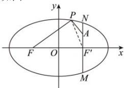

> [!faq]- 全练一本通解析
> **【解析】**
> 8
> 解析:由题意,设椭圆的右焦点为 $F'(1,0)$ , 连接 $PF'$
> $$
> \left| P A \right| + \left| P F \right| = \left| P A \right| + \left(4 - \left| P F ^ {\prime} \right|\right) = 4 + \left(\left| P A \right| - \left| P F ^ {\prime} \right|\right)
> $$
> 如图:
> 
> 当点 P 在位置 M 时， $\left|PA\right|-\left|PF'\right|$ 取到最大值 $\left|AF'\right|$ ，
> 当点 $P$ 在位置 $N$ 时， $\left|PA\right| - \left|PF'\right|$ 取到最小值 $-\left|AF'\right|$
> 所以 $\left|PA\right|-\left|PF'\right|$ 的取值范围是 $\left[-\left|AF'\right|,\left|AF'\right|\right]$ ，即 $[-1,1]$ ，
> $$
> \left| P A \right| + \left| P F \right|
> $$
> $$
> D _ {\max} + D _ {\min} = 8
> $$
> $$
> D _ {\max} = 5, | P A | + | P F |
> $$
> $$
> D _ {\min} = 3
> $$
