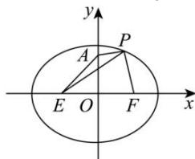

> [!faq]- 全练一本通解析
> **【答案】** C
>
> **【解析】**
> 解析： $\sqrt{x^{2}+y^{2}-2y+1}+\sqrt{x^{2}+y^{2}-2x+1}=\sqrt{x^{2}+(y-1)^{2}}+\sqrt{(x-1)^{2}+y^{2}}$ 点 $P(x,y)$ 是椭圆 $C:\frac{x^{2}}{5}+\frac{y^{2}}{4}=1$ 上的点，设 $E(-1,0), F(1,0), A(0,1)$ ，如图.
> 
> 记题中代数式为 $M$ ，则 $M = |PA| + |PF| = |PA| + 2\sqrt{5} -|PE|\geq 2\sqrt{5} -|AE| = 2\sqrt{5} -\sqrt{2}$ 等号当点 E, A, P 依次共线时取得. 因此所求最小值为 $2\sqrt{5}-\sqrt{2}$ .
>
> 故选 **C**.
