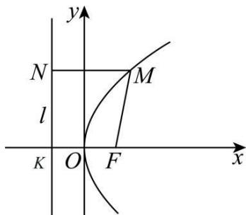

## 2. 标准方程的推导：

如图, 以过 F 且垂直于 l 的直线为 x 轴, 垂足为 K. 以 F, K 的中点 O 为坐标原点建立直角坐标系 xOy.

设 $\left|KF\right|=p\left(p>0\right)$ ，那么焦点F的坐标为 $\left(\frac{p}{2},0\right)$ ，准线l的方程为 $x=-\frac{p}{2}$ .

设点 $M(x,y)$ 是抛物线上任意一点, 点 M 到 l 的距离为 d.

由抛物线的定义, 抛物线就是集合 $P = \{M \parallel MF \mid = d\}$

因为 $|MF|=\sqrt{\left(x-\frac{p}{2}\right)^{2}+y^{2}}$ ， $d=\left|x+\frac{p}{2}\right|$

所以 $\sqrt{\left(x-\frac{p}{2}\right)^{2}+y^{2}}=\left|x+\frac{p}{2}\right|$

将上式两边平方并化简, 得 $y^{2}=2px(p>0)$ ①

方程①叫抛物线的标准方程, 它表示的抛物线的焦点在 x 轴的正半轴上, 坐标是 $\left(\frac{p}{2},0\right)$ 它的准线方程是 $x=-\frac{p}{2}$ .
