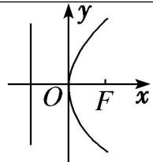
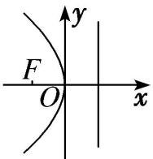
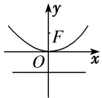
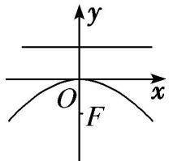

## 3. 抛物线的标准方程:

<table><tr><td></td><td> $y^{2} = 2px (p >0)$ </td><td> $y^{2} = -2px (p >0)$ </td><td> $x^{2} = 2py (p >0)$ </td><td> $x^{2} = -2py (p >0)$ </td></tr><tr><td>图形</td><td></td><td></td><td></td><td></td></tr><tr><td>焦点</td><td> $F\left(\frac{p}{2},0\right)$ </td><td> $F\left(-\frac{p}{2},0\right)$ </td><td> $F\left(0,\frac{p}{2}\right)$ </td><td> $F\left(0,-\frac{p}{2}\right)$ </td></tr><tr><td>准线方程</td><td> $x = -\frac{p}{2}$ </td><td> $x = \frac{p}{2}$ </td><td> $y = -\frac{p}{2}$ </td><td> $y = \frac{p}{2}$ </td></tr></table>

注:参数 p 的几何意义是焦点到准线的距离,恒为正,且 p 值越大,抛物线开口越大.
