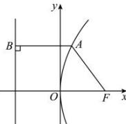

> [!faq]- 全练一本通解析
> **【答案】** B
>
> **【解析】**
> 解析：
> 
> 由抛物线上点 A 到焦点的距离为 10，则点 A 到抛物线 C 的准线的距离为 10，由抛物线 $C: y^{2} = 4px (p > 0)$ ，则其准线为直线 x = -p，
> 所以 $\frac{p}{4} + p = 10$ ，解得 p = 8。
>
> 故选 **B**.
