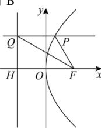

> [!faq]- 全练一本通解析
> **【答案】** B
>
> **【解析】**
> 
> 过点 F 作 l 的垂线, 垂足为 H, 因为直线 QF 的倾斜角为 $150^{\circ}$ , 则 $\angle QFH = 30^{\circ}$ ,
> 设 $\left|FH\right|=p=2$ ，因为 $y_{P}=\left|QH\right|=2\tan30^{\circ}=\frac{2\sqrt{3}}{3}$ ， $x_{P}=\frac{y_{P}^{2}}{4}=\frac{1}{3}$ ，
> 所以 $P\left(\frac{1}{3},\frac{2\sqrt{3}}{3}\right),\left|PF\right|=x_{P}+p=\frac{1}{3}+1=\frac{4}{3}$ .
>
> 故选 **B**.
