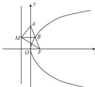

> [!faq]- 全练一本通解析
> **【答案】** $y^{2}=2\sqrt{2}x$
>
> **【解析】**
> 由抛物线的定义可得 $\left|BM\right|=\left|BF\right|$ ， $F(\frac{p}{2},0)$ ，又 $AM \perp MF$ ，所以点 B 为线段 FA 的中点，
> 又因为点 $A(0,2)$ ，所以 $B(\frac{p}{4},1)$ 又点 B 在抛物线上, 所以 $1=2p\times\frac{p}{4}$ , 解得 $p=\sqrt{2}$ , 所以抛物线 C 的标准方程为 $y^{2}=2\sqrt{2}x$ .
> 
