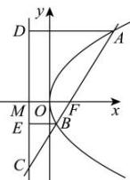

> [!faq]- 全练一本通解析
> **【答案】** A
>
> **【解析】**
> 解析:作 $BE \perp l$ 于点 E, l 与 x 轴交于点 M, 则 $AD // FM // BE$ ,
> 又 $\left|AF\right|=3$ 且 F 是 AC 的中点，则有 $\frac{\left|AD\right|}{\left|FM\right|}=\frac{\left|AC\right|}{\left|FC\right|=2}$ 即 $\left|AD\right|=2\left|FM\right|$ ，又 $\left|AD\right|=\left|AF\right|=3$ ，故 $\left|FM\right|=\frac{3}{2}$ 又 $\frac{\left|FM\right|}{\left|BE\right|}=\frac{\left|FC\right|}{\left|BC\right|}$ ， $\left|FC\right|=\left|AF\right|=3$ ， $\left|FB\right|=\left|BE\right|$ 故 $\frac{\frac{3}{2}}{\left|FB\right|}=\frac{3}{3-\left|FB\right|}$ ，即 $\left|FB\right|=1$ ，则 $\left|AB\right|=3+1=4$ 。故选：A.
> 
