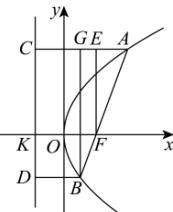

> [!faq]- 全练一本通解析
> **【答案】** D
>
> **【解析】**
> 解析：
> 
> 如图, 分别过点 A 、 B 向准线作垂线, 垂足分别为 C 、 D , 过点 B 、 F 分别作 $BG \perp AC$ 、 $FE \perp AC$ 于点 G 、 E , 准线与 x 轴交于点 K ,
> 设 $\left|BF\right|=m$ ，则由抛物线的定义可得 $\left|BD\right|=\left|BF\right|=m$ ， $\left|AC\right|=\left|AF\right|=2m$ ，
> 则 $\left|AG\right|=\left|CG\right|=m$ ， $\left|CE\right|=\left|KF\right|=p$ 因为 $\left|AF\right|=2\left|BF\right|$ ，所以 $\cos\angle EAF=\frac{\left|AG\right|}{\left|AB\right|}=\frac{m}{3m}=\frac{\left|AE\right|}{\left|AF\right|}$ ，则 $\left|AE\right|=\frac{2}{3}m,\left|CE\right|=2m-\frac{2}{3}m=\frac{4}{3}m=p$ , 解得 $m=\frac{3}{4}p$ 所以 $\left|BF\right|=\frac{3}{4}p$ .
>
> 故选 **D**.
