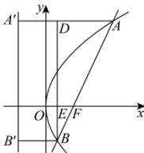

> [!faq]- 全练一本通解析
> **【答案】** C
>
> **【解析】**
> 解析:如图,设点 A, B 在抛物线 C 的准线上的投影分别是 $A', B'$ , 作 $BD \perp AA'$ , 垂足为 D, BD 与 x 轴交于点 E,
> 由题意可知 $|AF|=5+2=7$ 。设 $|BF|=m$ ，则 $|AD|=7-m, |EF|=4-m$ ，
> 易证 $\triangle BEF\sim\triangle BDA$ ，则 $\frac{|BF|}{|AB|}=\frac{|EF|}{|AD|}$ ，即 $\frac{m}{m+7}=\frac{4-m}{7-m}$ ，整理得 5m=14，
> 解得 $m = \frac{14}{5}$ ，故 $\frac{|BF|}{|AF|} = \frac{2}{5}$ .
> 
>
> 故选 **C**
